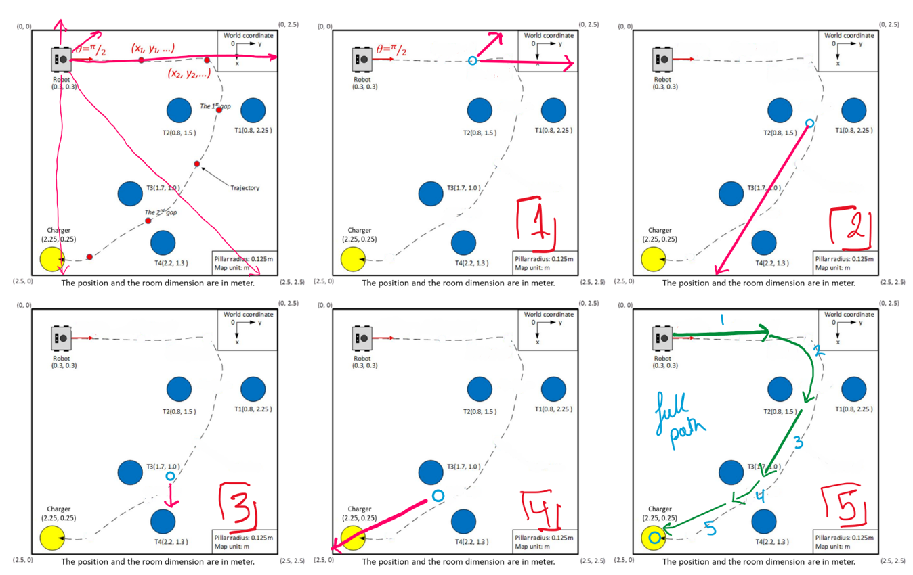

# 📊 Technical Overview & Control Strategy

## 🧭 Overview

The robot uses a **laser-based control strategy** to navigate through a fixed route toward a charging station. This method combines **laser scan detection** and **beacon-like artificial landmarks**, guiding the robot through various stages.

---

### 📷 Figure 1 - Laser-Based Control Strategy

- **Reddish-pink lines**: Laser detection range
- **Blue circles**: Artificial landmarks (used like beacons)
- The laser scans detect nearby obstacles (walls/pillars) to determine the robot’s proximity and current stage.
- Once a landmark is reached (via scan thresholds), a new motion instruction is triggered.

---

## 🔍 Strategy Explanation

The control system is based on a **stage-wise finite-state machine** that uses live LIDAR input:

- **Stage 1**: Detect long laser lines (far objects)  
- **Stage 2–5**: As the robot gets closer, laser ranges shorten and trigger the next movement
- **Final stage**: Robot stops at charging station once the goal is reached

Each laser line's length reflects proximity. The laser scan ensures real-time environmental feedback.

---

## 💻 Code Design Summary

This program is implemented using **ROS2 (in C++)**, utilizing modular node-based architecture. Key responsibilities are split across:

- **Laser Scanner**: Measures distances in five directions
- **Odometry**: Tracks robot’s current pose and heading
- **Mapping**: Converts laser points from polar to cartesian coordinates
- **Motion Control**: Directs the robot using `Twist` messages

### 🧱 Object-Oriented Structure (C++)

- **Structs**: Used for converting quaternions to Euler angles (for heading)
- **Arrays**: Velocity matrix for various actions (forward, right turn, etc.)
- **Case switch**: Implements stage-wise logic based on proximity readings
- **Publisher/Subscribers**:
  - Publishes to `/cmd_vel` for motion
  - Subscribes to `/scan` and `/odom` for feedback

### 📂 File Output

- **Laser scan** → `laser_scan.csv`  
- **Mapped scan points** → `laser_map.csv`  
- **Trajectory** → `odom_trajectory.csv`  
- **Velocity over time** → `velocity_data.csv`

---

## 🧪 Experimental Results

### 🛤️ Robot Trajectory

> The robot navigated through all waypoints accurately and reached the charging point.

Although the path was manually designed, the robot successfully adjusted at each stage using environmental cues.

---

### 📈 Velocity vs. Time

- Straight-line regions = constant forward motion  
- Cluttered line = turning behavior  
- Slowdown observed around **Stage 4** (correct behavior)

---

### 🗺️ Environment Map

> Map created dynamically using real-time laser data

- Walls and four central pillars detected
- Partial coverage due to limited scan field (front-facing only)
- Blind spots at the rear can be reduced by increasing sensor range or repositioning

---

## 📝 Summary

This ROS 2-based system demonstrates a simple yet effective reactive controller using laser feedback and odometry. With structured modular design and CSV logging, it’s suitable for:

- Basic autonomous navigation
- Obstacle avoidance logic
- Offline analysis and visualization
